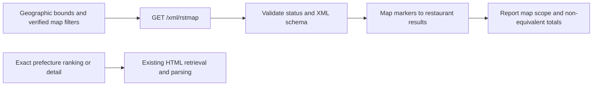

# Tabelog frontend API investigation

## Outcome

On 2026-10-09, headed Chromium Network inspection identified a working restaurant-data endpoint: `GET /xml/rstmap`. It supplies structured XML for the public map interface. Limited direct requests with Safari `curl_cffi`, without browser-cookie transfer, also returned HTTP 200 while ranking HTML requests remained challenged in the preceding experiment.

This is an undocumented frontend endpoint, not a verified supported public developer API. It searches a geographic rectangle and is not equivalent to a prefecture or national ranking. No Gurume runtime changes were made.

## Method

Used the existing headed Chromium session to observe public national/Mie yakitori ranking pages, a restaurant detail page, homepage autocomplete and search submission, and the Mie yakitori map. Saved selected response bodies to temporary files and examined their shapes. Performed a small number of read-only direct HTTP checks for observed endpoints. No private-account access, endpoint enumeration, challenge solving, or credential transfer was performed.

## Confirmed endpoints

| Endpoint | Method / response | Observed purpose | Gurume value |
| --- | --- | --- | --- |
| `/xml/rstmap` | GET / XML | Restaurant markers, scores, budgets, coordinates, pagination within map bounds | Strong candidate for an explicit geographic-search source |
| `/internal_api/suggest_form_words` | GET / JSON array | Area/keyword autocomplete and typed IDs | Already used by Gurume; useful for input normalization |
| `/contents/reserve_date_status_list` | GET / JSON | Date/status lists for supplied restaurant IDs | Potential reservation-calendar enrichment, not restaurant discovery |
| `/web-api/restaurants/<id>/prosperity` | GET / JSON | `pageViewCount`, `reservationCount`, `hozonCount` | Auxiliary counters; scope/time window not established |
| `/internal_api/restaurant_tel_call_available` | GET / JSON | Boolean `result` used by detail UI | UI capability flag, not restaurant details |
| `/contents/index` | GET / mixed JSON and HTML fragments | Welcome/user UI, bookmark buttons, settings, token-related content | Not a ranking-data replacement |
| `/contents/rstdtl_side` | GET / mixed JSON and HTML fragments | Restaurant sidebar UI and coupon content | Not a structured detail-data replacement |

Suggestions, a one-restaurant reservation calendar, and prosperity all returned 200/application-json during direct Safari `curl_cffi` checks. The ranking calendar request in Chromium showed 304 with a cached response body; the direct HTTP calendar check returned 200.

Additional observed requests included recruitment advertising, restaurant banners, advertising bundles, and `POST /web-api/restaurants/<id>/page-view`. The POST was generated by ordinary navigation; it is analytics, not a retrieval API, and was not manually replayed.

## Restaurant map XML

### Observed response

Opening https://tabelog.com/yakitori/mie/map/?SrtT=rt triggered `GET /xml/rstmap` with bounding coordinates, genre category fields, sort, page, and page-size parameters.

The response was `application/xml; charset=utf-8`:

```xml
<markers>
  <srchinfo cnt="271" nextpg="次の20件" prevpg="" />
  <marker id="24019007"
          rstname="にかわ"
          rsturl="/mie/A2403/A240301/24019007/"
          rstcat="焼き鳥、創作料理"
          score="3.93"
          rvwcnt="149"
          lat="34.49462941849498"
          lng="136.70590877454399"
          pcd="24"
          station_name="伊勢市、宮町、宇治山田"
          price_range2="￥15,000～￥19,999"
          price_range1="－" />
</markers>
```

Other attributes include `holiday`, `image_url`, `rvwlst_url`, optional `vac`, icon paths, and review-pickup text. `lunch_score` / `dinner_score` can be zero even when the overall score is populated; do not treat those zeros as actual meal ratings without further verification. Budget-field meaning and optional flags need dedicated validation before mapping to production models.

### Reduced request verified

This reduced query returned the same first-page IDs as the browser's longer request:

```python
from curl_cffi import requests

response = requests.get(
    "https://tabelog.com/xml/rstmap",
    params={
        "maxLat": "35.15027330463616",
        "minLat": "34.36048477324305",
        "maxLon": "137.25566568625933",
        "minLon": "135.85490885032183",
        "cat0": "RC",
        "cat1": "RC01",
        "cat2": "RC0106",
        "cat3": "RC010601",
        "pg": "1",
        "lst": "20",
        "SrtT": "rt",
    },
    impersonate="safari",
    timeout=30,
)
response.raise_for_status()
```

These are observed map-category identifiers. They are not interchangeable with Gurume's genre-code/path mapping. In particular, `RC010601` appeared in a valid map query, although manually using `/rstLst/RC010601/` previously displayed an all-cuisine ranking.

The reduced query is not proven minimal or sufficient for every filter. The full browser request also contained uppercase `PG`, duplicated `Cat`/`LstCat*` fields, dates, party size, budget, smoking, and reservation flags. Their effect was not independently tested.

### Pagination and direct access

- Browser page 1: HTTP 200, 20 markers, total 271.
- Browser clicking “次の20件”: a second XML request with `pg=2` and `PG=2`, HTTP 200.
- Direct Safari `curl_cffi` replay of each observed page URL: HTTP 200, 20 markers each, no shared IDs between pages.
- Direct reduced page-1 query: HTTP 200, same 20 IDs as the full page-1 query.
- No browser cookies, CSRF tokens, API keys, or custom referer were supplied in the direct calls.

Success during this session does not guarantee future access or imply any exemption from upstream access controls.

### Not equivalent to Mie ranking

The Mie ranking HTML reported 241 restaurants; this map viewport reported 271. Of the first 20 results, only 19 IDs overlapped, and ordering was not identical.

The map first page included 炭火焼鳥 かぐら with `pcd="23"` and an `/aichi/` restaurant URL. The ranking first page instead included 四日市炭火焼 串魂. The geographic rectangle crosses a prefecture boundary.

Filtering returned markers by `/mie/` or `pcd=24` can reject visible out-of-area results, but cannot make the API total 271 into a correct Mie-only total or establish ranking completeness. Do not claim exact area confidence, totals, or prefecture rank from this source.

## Search submission and suggestions

Homepage typing generated these observed requests:

- `GET /internal_api/suggest_form_words?sa=三重`.
- Keyword requests with `sk=焼き鳥`, followed by area context: `area_datatype=Prefecture`, `area_id=24`, latitude/longitude, related-info, and multi-suggestion fields.

Area results included `Prefecture`, `Town`, and `RailroadStation`, with `id`, `id_in_datatype`, names, and optional coordinates. Keyword results included `Genre3` (焼き鳥, `id_in_datatype=26`), `Genre2`, and `AreaRestaurant` records. Suggestion IDs are not proof of usable path or ranking API parameters.

Selecting a genre suggestion and submitting the normal GET search form navigated to an HTML `/mie/rstLst/` document with `Cat=RC`, `LstCat=RC01`, `LstCatD=RC0106`, `LstCatSD=RC010601`, and search/reservation parameters. Network inspection of that result showed document HTML plus auxiliary requests, not a JSON restaurant-ranking response. This experiment did not establish keyword-search equivalence or date/availability semantics.

## Candidates not verified

The preceding static bundle investigation found `/internal_api/rst_search` in a restaurant-link modal and `/internal_api/show_full_review_comment` for comment expansion. Neither was observed in the interactions covered here, manually replayed, or verified as a replacement for rankings/details. Do not describe them as confirmed usable search APIs.

No supported public developer API, complete structured restaurant-detail endpoint, or national ranking JSON endpoint was established by this limited inspection. This is not proof that none exists.

## Gurume recommendation

The strongest new candidate is an explicit map/geographic-search workflow using XML, rather than silently substituting it for `tabelog_search`.



Before implementation:

1. Review applicable usage restrictions and whether a supported licensed API is available.
2. Verify area/genre mappings, sorting, page limits, budget fields, missing values, and optional reservation flags; do not invent untested parameter contracts.
3. Preserve source evidence and distinguish map totals from prefecture ranking totals.
4. Add mocked XML response tests, including out-of-area markers, malformed XML, missing attributes, and challenge/error responses.
5. Keep existing HTTP 403 classification and bounded requests. Do not use API probing, browser retries, or cookie replay to work around a blocked endpoint.

Calendar data may later enrich already known restaurants, but status numbers and party/time dependence need UI-level verification first. Prosperity counters must not overwrite Gurume's all-time review/save counts: their counting window is unknown.

## Artifacts and validation

Temporary response files were kept under `/tmp/gurume-api-*.network-response`; session/token-bearing auxiliary response bodies were not copied into repository documentation. Direct HTTP checks and XML parsing were performed with `uv run python`. Only research documentation and one reusable memory/log entry were changed; no new runtime API integration was added.

Related reports:

- [Browser retrieval](tabelog-browser-research.md)
- [Static JavaScript investigation](tabelog-javascript-research.md)
