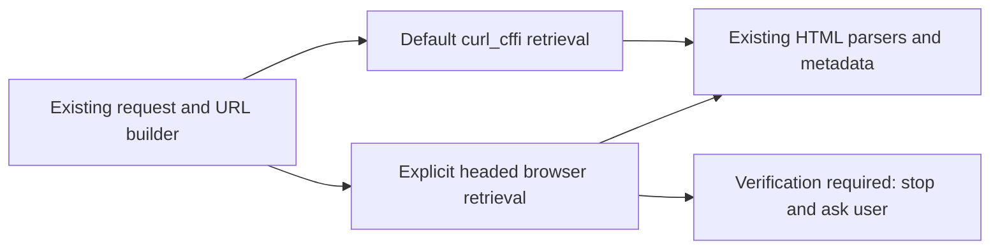

# Tabelog browser retrieval investigation

## Outcome

On 2026-10-09, headed Chromium through Chrome DevTools MCP retrieved normal ranking and restaurant documents where Gurume's current Safari `curl_cffi` client received HTTP 403 managed challenges. Existing Gurume parsers successfully consumed the browser's original document response bodies. Browser-backed retrieval is a credible improvement to investigate, not a demonstrated permanent fix.

No runtime implementation, dependency, automatic fallback, challenge solver, or cookie transfer was added.

## Environment

- Chrome DevTools MCP: 1.10.1.
- Executable: Playwright-installed `chromium-1248/chrome-linux64/chrome`.
- MCP launched with an explicit `--executablePath` and without `--headless`.
- Existing MCP browser profile/session was reused; this was not an isolated clean-profile experiment.
- Earlier headless navigation displayed a Cloudflare human-verification widget. The successful headed navigation did not require the agent to interact with that widget.

Installing Playwright Chromium did not automatically configure MCP to use it. The executable path fixed the earlier browser connection setup. That setup problem is separate from Gurume's upstream HTTP 403 failures.

## Same-URL comparison

Requests were made sequentially in the same local environment. Each direct HTTP probe used `requests.get(url, impersonate="safari", timeout=30)` with no imported browser cookies.

| URL | Safari curl_cffi | Headed Chromium |
| --- | --- | --- |
| `/rstLst/yakitori/?SrtT=rt&Srt=D` | 403; `cf-mitigated: challenge`; `Just a moment...`; no cards | Document 200; normal yakitori ranking; 20 cards |
| `/mie/rstLst/yakitori/?SrtT=rt` | 403; same challenge markers; no cards | Document 200; Mie yakitori ranking; 20 cards |
| `/tokyo/A1309/A130905/13266251/` | 403; same challenge markers; no cards | Document 200; normal かさ原 detail page |

`SearchRequest(area="三重", genre_code="RC0401", sort_type=SortType.RANKING)` generated `/mie/rstLst/yakitori/` with `SrtT=rt&PG=1`. Its `search_sync()` returned `error`, `http_status=403`, and zero restaurants. Browser navigation with those exact parameters displayed the Mie ranking with 20 cards and にかわ first. Missing `Srt=D` or an incorrect Gurume genre path therefore does not explain this case.

The earlier manually entered `/rstLst/RC010601/` URL displayed an all-cuisine ranking, not a yakitori ranking. Gurume already maps 焼き鳥 to `RC0401` and the `yakitori` path; no genre mapping correction is needed for this investigation.

## Parser compatibility

Original HTTP document bodies were saved through DevTools Network to temporary `.network-response` files, not reconstructed from visible text. They were passed directly to existing parsers without patching their selectors.

| Document | Parser | Observed result |
| --- | --- | --- |
| National yakitori | `RestaurantSearchRequest._parse_restaurants` | 20 restaurants; top ratings 4.56, 4.46, 4.46; names and dinner budgets parsed |
| National yakitori | `SearchRequest._parse_meta` | Total 32,585; next page available |
| Mie yakitori | Same search parsers | 20 restaurants; total 241; next page available; にかわ 3.93, 骨付鳥かもん 3.59, 藤ヶ丘食堂 3.47 |
| かさ原 detail | `RestaurantDetailRequest._parse_restaurant` | Name, 4.56 rating, 533 reviews, address, genre, hours, and dinner budget parsed |

Ranking data is already present in these document responses. An additional restaurant-ranking JSON API is not required for these pages. The inspection does not establish that all data on every Tabelog page is server-rendered.

Parser compatibility is not complete output correctness: multiple genres remained combined as one string in some ranking cards, and the detail reservation selector picked a generic booking guide. Reviews, menu, courses, pagination retrieval, keyword accuracy, and reservation availability were not tested.

## Recommended next implementation boundary

Keep the current HTTP path as the default. First build a small, explicitly invoked headed-browser proof of concept for search and basic detail retrieval, after reviewing Tabelog's usage restrictions. Do not make every 403 launch a browser automatically.

A browser transport should:

- Reuse URL construction and existing parsing; avoid separate MCP-only selectors.
- Return HTML, final URL, and HTTP status while preserving existing error classification.
- Wait for the expected result/detail content or an explicit challenge/error state, not all advertising requests to finish. A navigation timeout can occur after usable content has loaded, as observed in the first headed navigation.
- Treat a verification page as blocked, not an empty restaurant result, even if its status is 200.
- Leave any required human verification to the user; do not replay challenge cookies into the HTTP client or add stealth/challenge-solving logic.
- Bound page count and manage browser shutdown; avoid parallel browser fan-out until resource use is measured.

Chrome DevTools MCP is sufficient for this research but is not currently a Gurume library transport. A production integration still needs an explicit browser lifecycle and dependency decision. Do not assume the presence of MCP or Playwright browser binaries in Gurume installations.

## Limits and follow-up checks

Headless/headed mode, browser profile history, cookies, JavaScript execution, fingerprint, timing, and upstream conditions were not independently controlled. The experiment establishes that this headed session works while these HTTP requests fail; it does not identify Cloudflare's decisive detection signal.

Before shipping browser support:

1. Review applicable site usage restrictions and define the supported manual-access workflow.
2. Test a fresh headed profile and user-assisted verification without copying session secrets.
3. Verify second-page retrieval, detail subpages, cancellation, navigation timeout, challenge detection, and browser cleanup.
4. Mock browser boundaries in unit tests and confirm CLI/TUI/MCP retain consistent envelopes and errors.
5. Repeat limited authorized live checks over time; access can change independently of code.

## Validation

- Live browser/HTTP comparison and offline parsing of three original browser documents.
- `uv run pytest -q tests/test_restaurant.py tests/test_search.py tests/test_detail.py tests/test_http_client.py`: 122 passed.
- `uv run ty check .`: passed.

Only research documentation was added. Raw page bodies remain in temporary storage and were not committed. Browser cookies and challenge tokens are not included in this report.

For the earlier static JavaScript investigation, see [Tabelog JavaScript investigation](tabelog-javascript-research.md).
